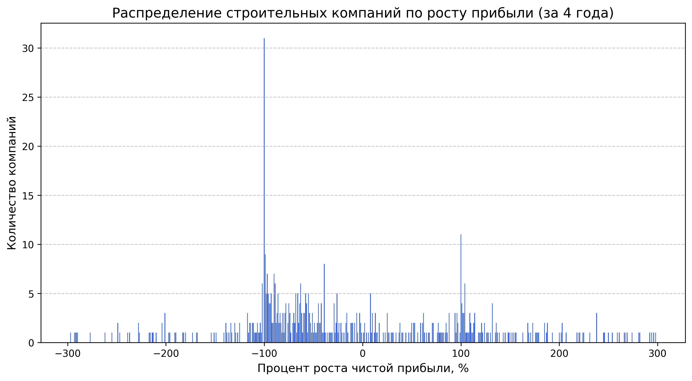
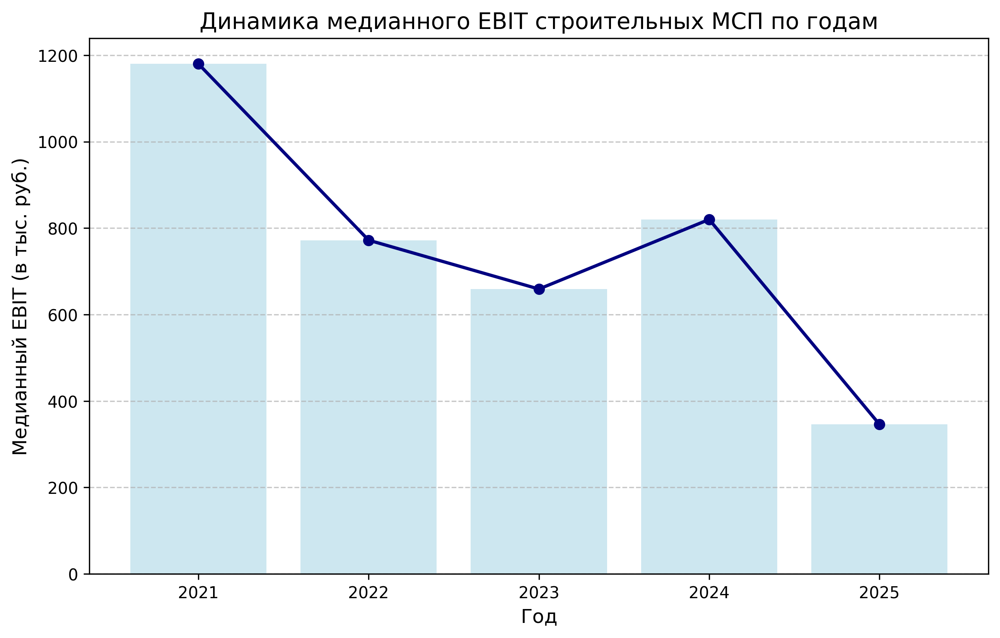
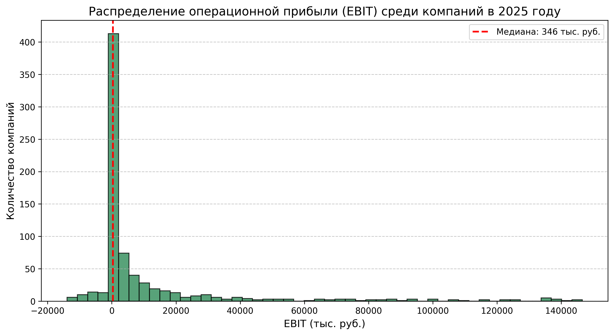

# Анализ финансовых показателей строительных МСП России (ОКВЭД 41.20)

Проект для автоматизированного сбора, обработки и визуализации финансовой отчетности малого и среднего строительного бизнеса России. Данные извлекаются с официального открытого API Федеральной налоговой службы (bo.nalog.gov.ru). 

Главная цель проекта — оценка «здоровья» отрасли через расчет операционной прибыли (EBIT) и динамики роста чистой прибыли компаний на N-летнем горизонте.

## Особенности проекта
* **Устойчивый парсинг (Fail-Fast архитектура):** Парсер корректно обрабатывает сетевые сбои, пропуски данных в базе ФНС и ошибки структур JSON. Падение на одной компании не прерывает общий сбор данных.
* **Финансовая аналитика:** Автоматический расчет метрики EBIT на основе строк бухгалтерского баланса (2300, 2330, 2400).
* **Очистка данных:** Фильтрация аномалий, выбросов (ограничение процента роста до ±300%) и обработка отсутствующих отчетов с использованием `pandas`.
* **Визуализация (Jupyter Notebook):** Построение аналитических отчетов с помощью `matplotlib` (динамика медианного EBIT, гистограммы распределения прибыли по рынку).

## Стек технологий
* **Язык:** Python 3.10+
* **Сбор данных:** `requests`
* **Анализ данных:** `pandas`, `numpy`
* **Визуализация:** `matplotlib`
* **Среда:** Jupyter Notebook / VS Code

## Структура репозитория
* `parsing.py` — модули для работы с API ФНС, извлечения финансовых результатов и подготовки данных для построения графиков.
* `main.py` — точка входа для пакетного сбора данных через консоль с логированием ошибок.
* `analytics_report.ipynb` — аналитический отчет с детальным разбором собранных данных, графиками и выводами.
* `Database.xlsx` — исходный список ИНН компаний для анализа.
* `cleaned_reestr.csv` - подготовленный датасет (фильтрация по ОКВЭД 41.20)
* `parser_errors.log` — файл логирования (генерируется автоматически), куда записываются ненайденные организации и сетевые таймауты.

## Установка и запуск

1. Клонируйте репозиторий:
```bash
git clone [https://github.com/shmu1k4OO/clinical-metrics-regression.git](https://github.com/shmu1k4OO/clinical-metrics-regression.git)
```
2. Для запуска пакетного сбора данных из консоли (укажите горизонт анализа N лет, например, 4):

```bash
python main.py 4
```
3. Для просмотра итогового исследования откройте analytics_report.ipynb в Jupyter Notebook или VS Code.

## Примеры визуализаций в отчете

Проект генерирует три ключевых графика для оценки состояния строительного рынка:

### 1. Распределение роста чистой прибыли
Показывает процентное изменение прибыли компаний относительно прошлых периодов.


### 2. Динамика медианного EBIT
Линейно-столбчатый график, отображающий восходящий или нисходящий тренд операционной маржинальности типичного участника рынка.


### 3. Распределение EBIT за последний год
Гистограмма с отсечением квантильных выбросов (top/bottom 5%) и линией медианы, показывающая долю убыточного и сверхприбыльного бизнеса.


**Полный анализ, обоснование метрик и выводы доступны в [analytics_report.ipynb](analytics_report.ipynb).**

## Автор
**shmu1k4OO**
- GitHub: [@shmu1k4OO](https://github.com/shmu1k4OO)
- *Смотрите также мой проект по машинному обучению: [Linear Regression for Clinical Metrics](https://github.com/shmu1k4OO/clinical-metrics-regression.git)*
